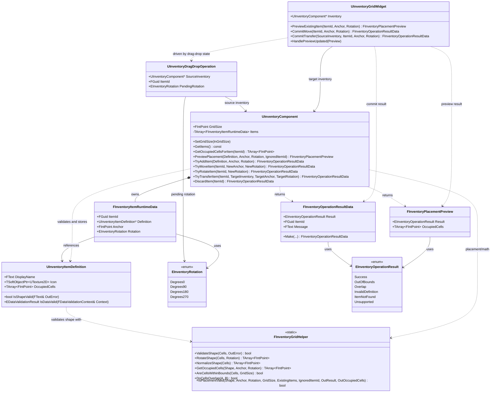

# Grid Inventory Class Diagram

This document reflects the inventory code currently implemented in `Source/InventoryBrawl/`. It is intended as a quick reference for how the inventory types relate to each other and which class owns each piece of behavior.

## Class Diagram

## Responsibilities

- `UInventoryItemDefinition`
  Holds editor-authored static item data. The important gameplay field is `OccupiedCells`, which is the canonical local-cell mask for the item shape.

- `FInventoryGridHelper`
  Holds all pure grid logic. It does not own state. It answers shape, rotation, bounds, overlap, and placement questions for both the asset validation path and the runtime component path.

- `UInventoryComponent`
  Owns runtime inventory state. This is the authoritative API for add, move, rotate, transfer, discard, and placement preview.

- `UInventoryDragDropOperation`
  Carries drag state through UMG. It does not validate or mutate inventory data.

- `UInventoryGridWidget`
  Bridges UMG interaction into `UInventoryComponent`. It forwards preview and commit requests instead of implementing gameplay rules directly.

- `FInventoryItemRuntimeData`
  Represents one runtime item instance inside an inventory. It ties an item id to a definition asset, anchor, and rotation.

- `FInventoryOperationResultData`
  Standard return payload for mutation operations.

- `FInventoryPlacementPreview`
  Standard return payload for preview operations.

## Call Flow

### Asset validation flow

1. The editor saves or validates a `UInventoryItemDefinition`.
2. `UInventoryItemDefinition::IsShapeValid(...)` calls `FInventoryGridHelper::ValidateShape(...)`.
3. `ValidateShape(...)` checks emptiness, duplicates, connectivity, and hollow regions.
4. If invalid, `IsDataValid(...)` reports the error through Unreal data validation.

### Preview flow

1. `UInventoryGridWidget::PreviewExistingItem(...)` looks up the runtime item inside its bound `Inventory`.
2. The widget extracts the item's `Definition`.
3. The widget calls `UInventoryComponent::PreviewPlacement(...)`.
4. `UInventoryComponent` validates the definition and calls `FInventoryGridHelper::IsPlacementValid(...)`.
5. The helper computes occupied cells and returns a placement result plus the target footprint.
6. The widget can pass that `FInventoryPlacementPreview` to `HandlePreviewUpdated(...)` for Blueprint-driven visuals.

### Add flow

1. Gameplay or setup code calls `UInventoryComponent::TryAddItem(...)`.
2. `UInventoryComponent` validates the definition via `UInventoryItemDefinition::IsShapeValid(...)`.
3. `UInventoryComponent` asks `FInventoryGridHelper::IsPlacementValid(...)` whether the item fits.
4. On success, the component appends a new `FInventoryItemRuntimeData` to `Items`.
5. The component broadcasts `OnInventoryChanged`.

### Move and rotate flow

1. UI or gameplay calls `UInventoryComponent::TryMoveItem(...)` or `TryRotateItem(...)`.
2. `TryRotateItem(...)` delegates to `TryMoveItem(...)` using the current anchor and a new rotation.
3. `TryMoveItem(...)` calls `FInventoryGridHelper::IsPlacementValid(...)` while ignoring the moving item's own id.
4. On success, the component updates the runtime record and broadcasts `OnInventoryChanged`.

### Transfer flow

1. `UInventoryGridWidget::CommitTransfer(...)` calls `SourceInventory->TryTransferItem(...)`.
2. `UInventoryComponent::TryTransferItem(...)` validates placement against the target inventory's grid size and items.
3. If valid, the source component copies the runtime record, applies the target anchor/rotation, removes the source record, and appends the copied record to the target inventory.
4. Both source and target broadcast `OnInventoryChanged`.

### Discard flow

1. UI or gameplay calls `UInventoryComponent::DiscardItem(...)`.
2. The component copies the runtime record for delegate payload purposes.
3. The component removes the item from `Items`.
4. The component broadcasts `OnItemDiscarded` and then `OnInventoryChanged`.

## Notes

- The class diagram intentionally shows dependencies rather than full Unreal inheritance trees, because the key maintenance question here is "who owns state and who calls whom."
- `FInventoryGridHelper` is the central rule engine. If placement behavior changes later, update helper logic first and then revisit component/widget behavior only if the API itself changes.
- `UInventoryGridWidget` currently depends on `UInventoryComponent::GetItems()` to look up the dragged item's definition during preview. If UI complexity grows later, a dedicated query API on `UInventoryComponent` may be cleaner than having widgets scan the item array.
